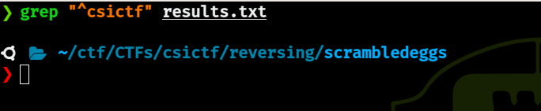
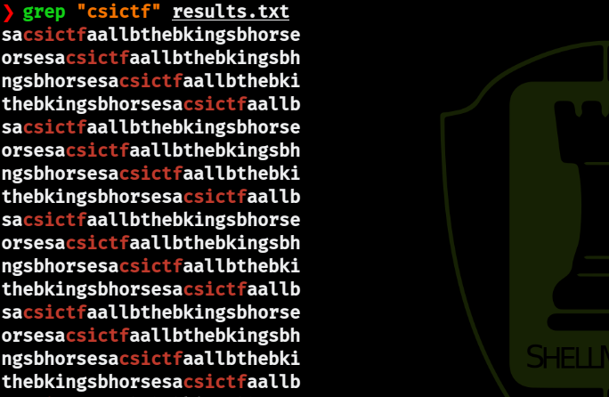

# Scrambled Eggs (csictf 2020) (499 pts)

## Challenge description

> I like my eggs sunny side up, but I ended up scrambling them.

In this **reversing**/**crypto** challenge, we are provided with two files : [scrambledeggs.txt](scrambledeggs.txt) which contains two encrypted keys and the encrypted flag, and [scrambledeggs.py](scrambledeggs.py) the python script that was used to encrypt the flag.

**scrambledeggs.txt** :
```
Encrytped key1 = xtfsyhhlizoiyx                                                                                                                  
Encrypted key2 = eudlqgluduggdluqmocgyukhbqkx                                                                                                    
Encrypted flag = lvvrafwgtocdrdzfdqotiwvrcqnd
```

**scrambledeggs.py** :
```python
import random 
import sys

map = ['v', 'r', 't', 'p', 'w', 'g', 'n', 'c', 'o', 'b', 'a', 'f', 'm', 'i', 'l', 'u', 'h', 'z', 'd', 'q', 'j', 'y', 'x', 'e', 'k', 's']

flag = 'csictf{this_is_a_fake_flag}'
flag = flag.replace('{','a')
flag = flag.replace('}','a')
flag = flag.replace('_','b')
key1 = 'ashikka_is_mine'
key1 = key1.replace('_','b')

if(len(flag) != 28 or len(key1) != 14):
    exit()
    
flag = list(flag)
key1 = list(key1)


def enc1(text):
    n = random.randint(0,sys.maxsize%28)
    return text[n:] + text[:n]
    
flag = enc1(flag)
    
def enc2(text):
    temp = ''
    for i in text:
        temp += map[ord(i)-ord('a')]
    return temp

key2 = enc2(enc2(key1))
key2 = list(key2)

for j in range(2):
    for i in range(14):
        temp1 = flag[i]
        flag[i] = flag[(ord(key1[i])-ord('a'))%28] 
        flag[(ord(key1[i])-ord('a'))%28] = temp1
        temp2 = key1[i]
        key1[i] = key1[(ord(key2[i])-ord('a'))%14] 
        key1[(ord(key2[i])-ord('a'))%14] = temp2
        
        
    for i in range(14,28):
        temp1 = flag[i]
        flag[i] = flag[(ord(key2[i-14])-ord('a'))%28] 
        flag[(ord(key2[i-14])-ord('a'))%28] = temp1
        temp2 = key2[i-14]
        key2[i-14] = key2[(ord(key1[i-14])-ord('a'))%14] 
        key2[(ord(key1[i-14])-ord('a'))%14] = temp2
        

l = random.sample([key1, key2], 2)
key1 = l[0]
key2 = l[1]

k = ''
for i in range(14):
    k += random.choice(map)
k = list(k)

key2 = k+key2
for i in range(14):
    a = ord(k[i])-ord('a')+ord(key2[i+14])
    if a>122:
        a=a%122
        a=a+97
    key2[i+14]= chr(a)

flag = ''.join(flag)
key1 = ''.join(key1)
key2 = ''.join(key2)
 
key2 = enc2(key2)
flag= enc1(enc1(enc1(enc2(flag))))

print('Encrytped key1 = '+key1)
print('Encrypted key2 = '+key2)
print('Encrypted flag = '+flag)
```

## Approach to the solution

### Understanding the script
After calmly reading and trying to understand the script above, we can summarize its steps as the following points :
- we start off with the assignment of `flag` and `key1` (which both are not the actual ones obviously)
```python
flag = 'csictf{this_is_a_fake_flag}'
flag = flag.replace('{','a')
flag = flag.replace('}','a')
flag = flag.replace('_','b')
key1 = 'ashikka_is_mine'
key1 = key1.replace('_','b')
```
- `flag` is encrypted using the `enc1` function
```python
flag = enc1(flag)
```
- `key2` is assigned as the double encryption of `key1` using the `enc2` function
```python
key2 = enc2(enc2(key1))
```
- then comes the big double loop, which simply makes a few swaps between the characters of `flag`, `key1` and `key2`
```python
for j in range(2):
    for i in range(14):
        temp1 = flag[i]
        flag[i] = flag[(ord(key1[i])-ord('a'))%28] 
        flag[(ord(key1[i])-ord('a'))%28] = temp1
        temp2 = key1[i]
        key1[i] = key1[(ord(key2[i])-ord('a'))%14] 
        key1[(ord(key2[i])-ord('a'))%14] = temp2
        
        
    for i in range(14,28):
        temp1 = flag[i]
        flag[i] = flag[(ord(key2[i-14])-ord('a'))%28] 
        flag[(ord(key2[i-14])-ord('a'))%28] = temp1
        temp2 = key2[i-14]
        key2[i-14] = key2[(ord(key1[i-14])-ord('a'))%14] 
        key2[(ord(key1[i-14])-ord('a'))%14] = temp2
```
- after that, there is a possibility that `key1` and `key2` are swapped
```python
l = random.sample([key1, key2], 2)
key1 = l[0]
key2 = l[1]
```
- random characters are appended to `key2`, and using those characters `key2`'s characters are modified
```python
k = ''
for i in range(14):
    k += random.choice(map)
k = list(k)

key2 = k+key2
for i in range(14):
    a = ord(k[i])-ord('a')+ord(key2[i+14])
    if a>122:
        a=a%122
        a=a+97
    key2[i+14]= chr(a)
```
- `key2` is encrypted using the `enc2` function
```python
key2 = enc2(key2)
```
- `flag` is encrypted using the `enc2` function, and then encrypted three times using the `enc1` function
```python
flag= enc1(enc1(enc1(enc2(flag))))
```
- finally `key1`, `key2` and `flag` are printed
```python
print('Encrytped key1 = '+key1)
print('Encrypted key2 = '+key2)
print('Encrypted flag = '+flag)
```

### How to approach this ?
The general approach to take for this type of challenges is to first start by identifying and dividing the big individual problems/steps and come up with solutions for them if possible, then we procede to reverse each step starting from the bottom heading to the top, and we have to make sure to mark the steps where different values could come up, in our case, these are the steps where random values are used. Since we cannot guess those values, we use brute force by computing all the possible combinations.

So first, let's start by identifying the steps where brute force is needed and where not :
- the `enc1` function uses random values to determine where to split the `text` argument, that means brute force is required
```python
def enc1(text):
    n = random.randint(0,sys.maxsize%28)
    return text[n:] + text[:n]
```
- the `enc2` function simply maps characters from `text` to the `map` defined at the top of the script, so we can "undo" that
```python
map = ['v', 'r', 't', 'p', 'w', 'g', 'n', 'c', 'o', 'b', 'a', 'f', 'm', 'i', 'l', 'u', 'h', 'z', 'd', 'q', 'j', 'y', 'x', 'e', 'k', 's']
```
```python
def enc2(text):
    temp = ''
    for i in text:
        temp += map[ord(i)-ord('a')]
    return temp
```
- the big double loop looks daunting but it is easily reversible by litteraly reversing the steps
- the key swapping is out of our control, we have to consider the two cases where `key1` and `key2` are swapped and when they are not
- the part where random characters are mixed with `key2` aspires that we need to use brute force, but we will find out later that we can actually recover `key2` without using brute force

## Crafting the solution
Now that we have identified the major steps of the encryption and the steps that require brute force, we can begin writing the solution. We will start off by writing some functions that will help us reverse some steps.

### reversing `enc1`
The `enc1` function generates first a random number `n` using `random.randint(0, sys.maxsize%28)`, `sys.maxsize` refers to the platform's pointer size, for 64-bit machines that's `2**63-1`, therefore, if we assume that the machine used to run the script is 64-bit `sys.maxsize%28` evaluates to `7`.

Since we can't guess the random numbers generated, we will simply define the reverse function `dec1` to take two arguments `text` and `n` :
```python
def dec1(text, n):
    assert(0 <= n < 28)
    return text[-n:] + text[:-n]
```
Then in our main function, we will make sure to generate all the possible values for `n` (0 to 7)

### reversing `enc2`
On the other hand `enc2` is easily reversible by remapping the characters of `text` like this :
```python
def dec2(text):
    # map each character of text to the character of order :
    # index of text[i] in scramble_map + ord('a')
    return ''.join(chr(scramble_map.index(char) + ord('a')) for char in text)
```

### unlooping
As stated before, we reverse the big double loop by simply reversing the steps, just like this :
```python
def unloop(key1, key2, flag):
    key1, key2, flag = list(key1), list(key2), list(flag)
    assert (len(key1) == len(key2) == 14)
    for j in range(2):
        # we make sure the range is from 27 to 14, not 14 to 27
        for i in range(27, 13, -1):
            # taking advantage of python's built-in way to swap values
            # rather than using a temp variable
            index = (ord(key1[i-14]) - ord('a')) % 14
            key2[index], key2[i-14] = key2[i-14], key2[index]

            index = (ord(key2[i-14]) - ord('a')) % 28
            flag[i], flag[index] = flag[index], flag[i]

        for i in range(13, -1, -1):
            index = (ord(key2[i]) - ord('a')) % 14
            key1[index], key1[i] = key1[i], key1[index]

            index = (ord(key1[i]) - ord('a')) % 28
            flag[i], flag[index] = flag[index], flag[i]

    return ''.join(key1), ''.join(key2), ''.join(flag)
```

### recovering `key2`
We said before that the part where 14 random characters were mixed up with `key2` is reversible without brute force, that's because those random chars are appended to `key2` and not scrambled afterwards, so here are the steps to recover `key2` :
```python
def recover_key2(ekey2):
    assert(len(ekey2) == 28)
    # the random characters are the 14 first
    k = ekey2[:14]
    # the list of `a`s
    alist = list(map(ord, ekey2[14:]))
    res = ''
    for i in range(14):
        # we simply compute c using linear equations
        c = alist[i] - ord(k[i]) + ord('a')
        # since all characters are ascii lowercase
        # this check helps avoiding multiple potential values
        if not ord('a') <= c <= ord('z'):
            c += 122 - 97
        res += chr(c)
    return res
```

### Wrapping everything up
In order to join everything we have been working on, we simply reverse the steps of the total encryption from bottom to top :
1. Generate combinations of three `n`s (from 0 to 7)
```python
randsize = 7
```
```python
combinations = [p for p in itertools.product(range(randsize+1), repeat=3)]
```
2. Use the combinations to call `dec1` three times on the encrypted flag, and then call `dec2` (we can call `dec2` first since `dec1` doesn't change the characters of `text`)
```python
flag = dec2(eflag)
```
```python
for c in combinations:
	flag = dec1(dec1(dec1(flag, c[0]), c[1]), c[2])
```
3. Call `dec2` on the encrypted `key2`
```python
key2 = dec2(ekey2)
```
4. Recover `key2` using `recover_key2`
```python
key2 = recover_key2(key2)
```
5. Choose whether to swap `key1` and `key2` or not
```python
swapkeys = True
```
```python
if swapkeys: key1, key2 = key2, key1
```
6. Undo the big double loop using `unloop`
```python
key1, key2, flag = unloop(key1, key2, flag)
```
7. Since originally, before the loop, `key2` is equal to `enc2(enc2(key1))` we can check whether that is true to minimize the results
```python
if dec2(dec2(key2)) == key1:
```
8. Once again we generate `n`s to decrypt `flag` with `dec1`
```python
for n in range(randsize + 1):
    flag = dec1(flag, n)
    results.append(flag)
```
9. Finally, we can store all the resulting flags in a file named "results.txt", so that we can check out if it contains the actual correct flag
```python
outfile = 'results.txt'
```
```python
with open(outfile, 'w') as f:
    f.write('\n'.join(results))
    f.close()
```
**Note** : steps 3, 4 and 5 can be done before generating the combinations since those combinations affect only `flag`

### The main function
```python
combinations = [p for p in itertools.product(range(randsize+1), repeat=3)]
key1 = ekey1
key2 = recover_key2(dec2(ekey2))
flag = dec2(eflag)
if swapkeys: key1, key2 = key2, key1
original = flag, key1, key2
results = []
for c in combinations:
    flag = dec1(dec1(dec1(flag, c[0]), c[1]), c[2])
    key1, key2, flag = unloop(key1, key2, flag)
    if dec2(dec2(key2)) == key1:
        for n in range(randsize + 1):
            flag = dec1(flag, n)
            results.append(flag)
    flag, key1, key2 = original
with open(outfile, 'w') as f:
    f.write('\n'.join(results))
    f.close()
```
The full script is [here](solve.py)

## Unscrambled Eggs
On the first try, when `swapkeys` is set to `False`, "results.txt" turns out to be empty. But then after setting that to `True`, the file is quite populated, that could mean that we've been successful.

`grep "^csictf" results.txt` :



Hmmm.. we get nothing

`grep "csictf" results.txt` :



Ah ! we get some results now, if we replace some `a`s and `b`s to `{`, `}` and `_` in `sacsictfaallbthebkingsbhorse` we can read `s}csictf{all_the_kings_horse`.

It is trivial now that the **flag** is :
```
csictf{all_the_kings_horses}
```
